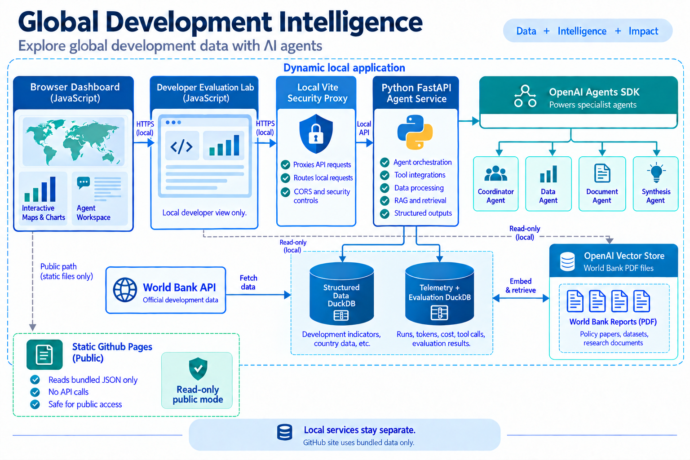

# Global Development Intelligence

An educational portfolio project showing how a small agentic AI system can combine World Bank statistics, report evidence, tools, safeguards, evaluation, and cost tracking.



The repository supports two modes:

- **Static demo:** a GitHub Pages-ready JavaScript dashboard using reviewed data snapshots. It never calls OpenAI or a local backend.
- **Local application:** the same dashboard can connect to a Python backend and its configured live AI service. It is deliberately kept separate from the public site.

## Where to start

| If you want to… | Start here |
|---|---|
| Understand the product | [`docs/BRD.md`](docs/BRD.md) and [`docs/PRD.md`](docs/PRD.md) |
| See the architecture | [`docs/flowarchitecture.mmd`](docs/flowarchitecture.mmd) |
| Run the dashboard | [`frontend/README.md`](frontend/README.md) |
| Run the Python API | [`backend/README.md`](backend/README.md) |
| Understand an agent | [`agent_instructions/README.md`](agent_instructions/README.md) |
| Rebuild the databases | [`data/README.md`](data/README.md) |
| Run evaluations | [`evals/README.md`](evals/README.md) |
| Inspect local evaluation telemetry | [`evaluation-ui/`](evaluation-ui/) |
| Follow one request end to end | [`docs/WORKFLOW_WALKTHROUGH.md`](docs/WORKFLOW_WALKTHROUGH.md) |

## Data stores

The application uses two separate DuckDB files:

1. `structured.duckdb` for World Bank indicators and country metadata.
2. `telemetry.duckdb` for agent/model/tool calls, token usage, estimated costs, audit events, and evaluation results.

For the local app, the same telemetry store also holds up to three compact,
expiring follow-up summaries for the current browser session. It is never
included in the public static site.

Small reproducible samples may be committed. Mutable local databases and private runtime data remain ignored.

## Developer evaluation UI

`evaluation-ui` is a separate local-only dashboard for inspecting this project's
DuckDB telemetry: evaluation cases, recent agent/tool runs, token and cost
records, and managed-vector-store file status. Start it separately with
`npm run dev --prefix evaluation-ui`; it listens on `http://127.0.0.1:4175`.
It does not duplicate the OpenAI Platform: managed raw embedding coordinates
are not available, so it shows the indexed-file metadata returned by the
configured vector store instead.

The main dashboard runs on port `4173`. The Evaluation Lab runs separately on
port `4175` and is intentionally excluded from GitHub Pages because it reads
private local telemetry and the managed-vector-store status.

## Safety boundary

Never add credentials or local runtime data to this repository. The browser never receives credentials. Static builds contain no live-agent transport.

This project is an analytical demonstration. It must show sources, units, years, missing data, and limits; generated explanations do not establish causation or constitute policy or investment advice.

## What is included

The static dashboard includes a sourced 17-country World Bank snapshot, with
up to ten countries compared at once. The local backend can refresh selected
countries from the public [World Bank Indicators API](https://api.worldbank.org/v2/)
and return direct, checked answers for short facts without a model. Managed report
RAG is an explicit setup step: PDFs must be attached and indexed in the
managed vector store before they can be retrieved. The [corpus guide](docs/corpus/README.md)
documents that step; it is deliberately separate from the safe, static dashboard export.

## Before publishing

Run the checks below, then inspect the files that Git will publish:

```bash
cd backend && .venv/bin/python -m pytest -q
cd ../frontend && npm run build && npm run test:sites
cd .. && git status --short
```

Only publish the source, documentation, reviewed public fixtures and static
frontend. Local environment files, DuckDB runtime databases, raw documents,
logs and build output are excluded by [`.gitignore`](.gitignore).

The local owner preview currently enables low-cost live chat with GPT-5 nano
and a 3¢ per-run cap. Model-assisted cleaning, embedding/indexing, and sandbox
execution remain disabled. Nothing has been published or deployed.
