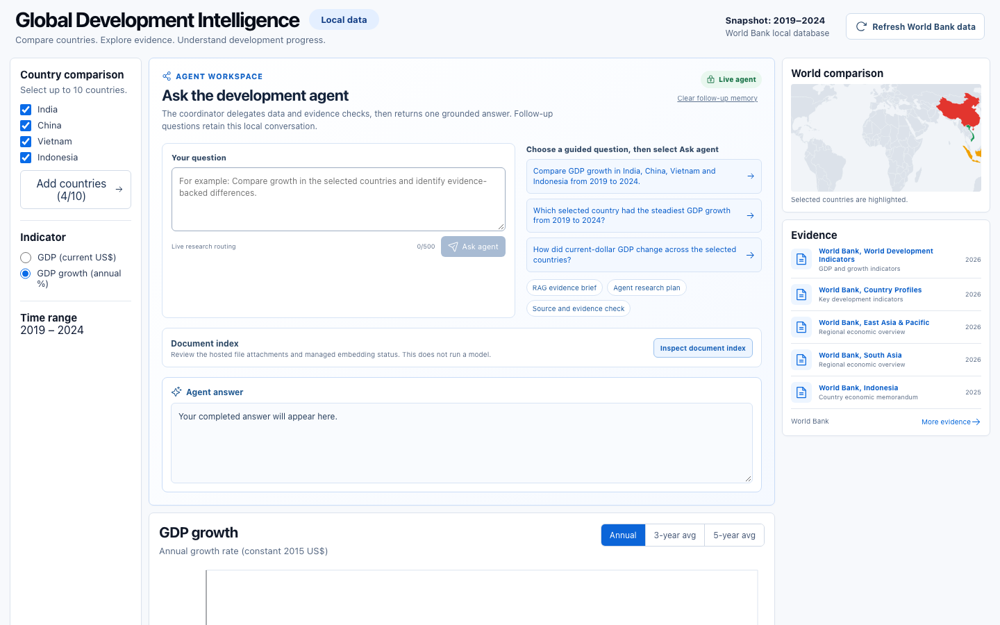

# Global Development Intelligence

A mini experimental portfolio project that explores an agentic AI workflow for comparing countries with World Bank statistics and report evidence.

## Application preview

## Explore the project

| Topic | Start here |
| --- | --- |
| Architecture | [`docs/flowarchitecture.mmd`](docs/flowarchitecture.mmd) |
| Product workflow and code map | [`docs/WORKFLOW_WALKTHROUGH.md`](docs/WORKFLOW_WALKTHROUGH.md) |
| Beginner-friendly project guide | [`docs/PROJECT_GUIDE.md`](docs/PROJECT_GUIDE.md) |
| Data sources and attribution | [`docs/DATA_SOURCES.md`](docs/DATA_SOURCES.md) and [`NOTICE.md`](NOTICE.md) |
| Dashboard | [`frontend/README.md`](frontend/README.md) |
| Python service | [`backend/README.md`](backend/README.md) |
| Agent instructions | [`agent_instructions/README.md`](agent_instructions/README.md) |
| Data refresh and storage | [`data/README.md`](data/README.md) |
| Evaluation checks | [`evals/README.md`](evals/README.md) |

## What it demonstrates

- A JavaScript dashboard for country comparison, charts, map exploration and guided questions.
- A Python service that refreshes selected World Bank indicators into DuckDB.
- Agent routing: short conversation receives a concise response; development-data questions use specialist retrieval and synthesis.
- Retrieval-augmented generation (RAG) over reviewed World Bank reports through a managed vector store.
- Follow-up context, deterministic evaluation checks, and local run telemetry.
- A separate Evaluation Lab for inspecting project quality checks, indexed-document metadata and local run summaries.

## Static and local experiences

The static dashboard is suitable for GitHub Pages and uses a reviewed World Bank snapshot. The local application can refresh data and run the full research workflow. The public demo remains read-only and does not make live AI requests.

## Sources and use

World Bank indicators and report links are used with attribution. Source materials, licences and map terms are described in [`NOTICE.md`](NOTICE.md) and [`docs/DATA_SOURCES.md`](docs/DATA_SOURCES.md). This is an independent project and is not endorsed by the World Bank, Survey of India, or any other source provider.

This project is a mini experiment, not an authoritative source. Verify data, dates, units, citations and generated output before relying on them.
