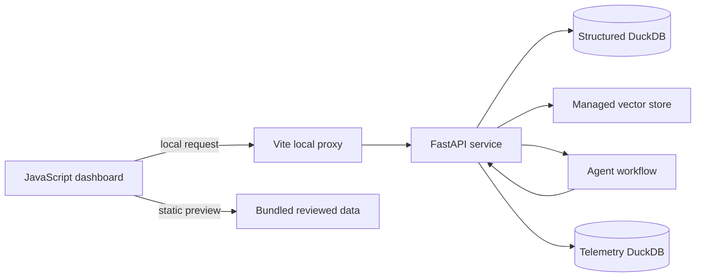

# Technical Design Document — Global Development Intelligence

| Field | Value |
| --- | --- |
| Status | Learning artifact aligned to the implemented MVP |
| Architecture style | Separate JavaScript frontend, Python API service, local DuckDB storage, managed document retrieval |
| Primary design goal | Produce inspectable, source-backed country comparisons while keeping the public portfolio preview static. |

## 1. Design overview

The project separates the browser interface from the Python service. The JavaScript dashboard supports a static preview and a local live workflow. The local workflow stores structured World Bank observations in DuckDB, uses a managed vector store for reviewed report retrieval, and records telemetry/evaluation output in a separate DuckDB file.

The detailed visual architecture is available in [flowarchitecture.mmd](flowarchitecture.mmd).

## 2. Components and responsibilities

| Component | Location | Responsibility |
| --- | --- | --- |
| Dashboard | `frontend/src/` | Country controls, charts, map, question workspace and static interaction. |
| Local proxy | `frontend/scripts/local-data-proxy.mjs` | Sends local browser requests to the Python API without adding backend behavior to the static site. |
| API boundary | `backend/app/main.py` | HTTP contracts, request validation, routing and response assembly. |
| Agent workflow | `backend/app/live_agents.py` | Orchestrator, structured-data specialist, document specialist and synthesis agent. |
| Agent guidance | `agent_instructions/*.txt` | Bounded role instructions for orchestration, retrieval and synthesis. |
| Structured data | `backend/app/repository.py`, `data/runtime/structured.duckdb` | Approved observations, source URL, year and unit retrieval. |
| Refresh pipeline | `backend/app/data_refresh.py` | Fetches allowlisted World Bank API data and validates it before storage. |
| Managed RAG | `backend/app/vector_store.py` | Inspects and searches the configured managed index. |
| Follow-up memory | `backend/app/conversation_memory.py` | Stores limited local summaries and clears session context on request. |
| Telemetry | `backend/app/telemetry.py`, `data/runtime/telemetry.duckdb` | Records runs, tool calls, model calls and evaluation results. |
| Evaluation Lab | `evaluation-ui/` | Reads aggregate local diagnostics and managed-index status. |

## 3. Runtime flows

### 3.1 Static portfolio preview

1. GitHub Pages serves the compiled frontend and reviewed fixture data.
2. The dashboard filters and visualises that data in the browser.
3. Guided static examples remain local to the browser.
4. No Python service, live model call, local telemetry, or conversation context is used.

### 3.2 Local development-data request

1. The dashboard submits a validated question, selection context and browser-session ID through the local proxy.
2. The API checks prompt safety, live-chat configuration and per-run budget.
3. The service creates a run record in telemetry.
4. The orchestrator delegates to the structured-data specialist and, where appropriate, the document specialist.
5. Structured retrieval returns bounded DuckDB observations. Document retrieval queries the managed index only when it is configured and ready.
6. The synthesis agent uses the returned evidence to produce a concise answer with citations and limitations.
7. The API validates returned facts and source identifiers, saves telemetry and a compact follow-up summary, then returns a typed response to the dashboard.

### 3.3 Casual conversation

1. The API detects that the prompt has no development-data intent.
2. It runs one concise low-cost model response without specialist tools or handoffs.
3. The result is recorded as a casual run for local observability.

## 4. Data design

| Store | Contents | Why separate |
| --- | --- | --- |
| `structured.duckdb` | Country/indicator observations, units, source URLs and refresh metadata. | Supports reproducible chart and numeric retrieval. |
| Managed vector store | Reviewed World Bank documents indexed for semantic retrieval. | Keeps document and query embeddings compatible within one managed retrieval service. |
| `telemetry.duckdb` | Run status, tool/model calls, local context summaries and evaluation results. | Prevents operational records from being mixed with analytical data. |

The application shows managed index status at file level because the managed service does not expose raw embedding coordinates. It does not claim that an embedding visualisation represents the provider's internal vectors.

## 5. Agent and tool boundaries

| Agent | Inputs | Allowed tools | Output responsibility |
| --- | --- | --- | --- |
| Orchestrator | User question and selected context | Approved handoffs only | Chooses bounded research path. |
| Structured-data specialist | Country, indicator and period | Repository lookup | Returns observations, source, units and gaps. |
| Document specialist | Research question | Managed vector-store search | Returns retrieved passages or explicit unavailability. |
| Synthesis agent | Tool outputs and local context summary | No arbitrary database access | Produces cited, limited interpretation. |

Deterministic Python validation remains the enforcement layer. Agent instructions tell models what to do; the API determines what tools they can actually use.

## 6. Key interfaces

| Interface | Contract purpose |
| --- | --- |
| Dashboard → local proxy | Keeps frontend interaction independent of the backend implementation. |
| Local proxy → FastAPI | Sends typed local requests for data refresh, agent chat, memory removal and index inspection. |
| FastAPI → World Bank API | Fetches approved indicator observations. |
| FastAPI → managed vector store | Lists indexed files and retrieves relevant document evidence. |
| FastAPI → DuckDB | Reads structured observations; writes telemetry and evaluation results. |

## 7. Reliability, security and observability

- **Validation:** request and output schemas restrict the data exchanged between frontend and backend.
- **Least privilege:** agents receive narrow retrieval tools, not unrestricted database or shell access.
- **Guardrails:** prohibited prompt patterns, budget checks, citation validation and causal-restraint instructions prevent known unsafe or unsupported behavior.
- **Observability:** runs, tools, models, latency, token counts, cost estimates and evaluation results are recorded locally.
- **Tests:** Python unit tests cover API, refresh, safety, memory and telemetry behavior; frontend checks verify static-site behavior; deterministic evaluation cases provide regression checks.

## 8. Technical trade-offs and future work

| Decision | Benefit | Trade-off / future improvement |
| --- | --- | --- |
| DuckDB for observations and telemetry | Simple local setup and inspectable SQL. | A shared production service would require managed storage and access control. |
| Managed file search for RAG | Compatible document/query embeddings and simple index management. | Raw vector coordinates are not available to the application. |
| Separate specialists | Clear evidence path and model-cost flexibility. | More latency than a single completion for simple questions. |
| Static public preview | Safe and easy to host. | It cannot provide live answers. |
| Deterministic evaluations | Fast, reproducible baseline checks. | Add curated human review or model-based grading for broader answer-quality assessment. |
